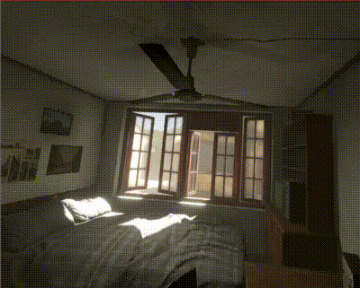

## WebGL Panorama180 Movement (Demo)

[English readme](./README.md)

# はじめに

このプロジェクトは、Unityで作られた以下のプロジェクトのWebVR版になります。    

https://github.com/ft-lab/Unity_Panorama180Movement

WebGL(WebVR)で、パノラマ180度-3Dの空間を少し移動できるプロジェクトです。    
Oculus Rift/Oculus Questで動作確認しています。    
VR180などの180度パノラマ-3D画像を使用した場合、VR上ではカメラを中心に向きを変えることができますが移動することはできません。    
3DoFの動作となります。    
このパノラマ画像を使用したVR空間上で特定の方向に移動できるようにし、
また、極力負荷をかけない計算を行い、制限付きの6DoF操作ができるようにします。    

     

## 開発環境

three.js r104    

## ソース説明

three.jsのJavaScriptファイルは、「../threejs」内に配置しています。    
three.jsのファイルは、このGitHubのリポジトリには内包していません。    
環境に合わせて書き換えるようにしてくださいませ。    

    
    
    		

## 使い方

以下に実行サンプルのURLです。    
ブラウザ上でOculus RiftやOculus Questを使ってアクセスします。    
VRで左前に移動すると約2mの直線距離を移動できます。    

https://ft-lab.jp/WebGL/WebGLTest/Panorama180Movement/panorama180_movement.html

## アルゴリズム解説

以下で、本デモのアルゴリズムを記述しています。    

https://ft-lab.jp/VRTest/algorithm_jp.html

## WebVR(three.js)移行時に考慮した点

### GPUキャッシュにテクスチャを乗せる

全部で4Kテクスチャを24枚使用しています。    
Oculus Questではテクスチャを生成時にまだGPUキャッシュには乗っていないようで、    
強制的にRenderTargetに前処理でオフスクリーン描画させることで、GPUキャッシュ乗せるようにしてます。    
これを行わない場合、移動の初回時に少し遅延していました。    

### Depthをhdr形式で保持し、読み込み

exr読み込みだとテクスチャ作成までに時間がかかったため、hdrとしました。    

## 素材作成時の使用アセット

このリソースとしてのパノラマ画像は、Unity Asset Storeから以下のアセットを使用して出力しています。    

- Asia-Pacific Common Residential Theme Pack    
https://assetstore.unity.com/packages/templates/packs/asia-pacific-common-residential-theme-pack-135233

- Panorama180 Render
https://assetstore.unity.com/packages/tools/utilities/panorama180-render-141234

パノラマ画像のレンダリングシーンとして、"Asia-Pacific Common Residential Theme Pack"を使用しました。    
180度パノラマ-3D画像の生成は"Panorama180 Render"(ver.1.0.2)を使用して出力しました。    

## 更新履歴

### [06/02/2019]

- はじめのリリース

